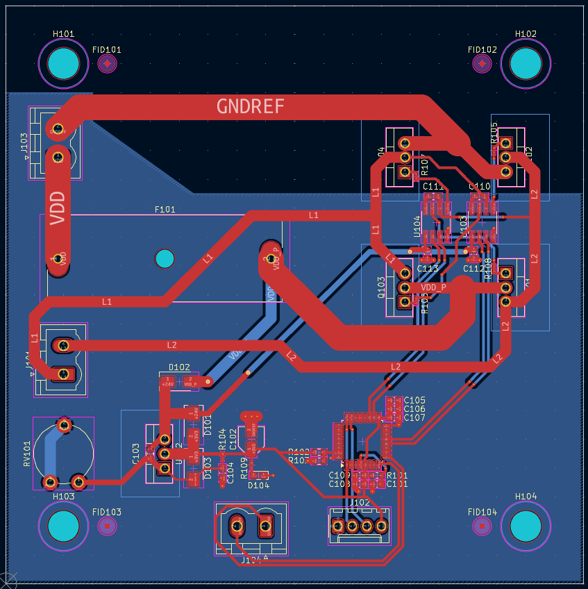

# ⚡ PCB_DC_Driver
**Single DC Motor Driver with H-Bridge Architecture**

---

  

---

## 📘 Overview
**PCB_DC_Driver** is a theoretical yet practical design for a **DC motor driver** built around an **H-Bridge architecture** using dedicated gate drivers.  
The project focuses on achieving an efficient, compact, and manufacturable design while following **Design for Assembly (DFA)** and **Design for Manufacturing (DFM)** principles.

  
   
  <em>3D render of the finished PCB_DC_Driver board</em>

---

## ⚙️ General Information
- Theoretical **simple DC driver** implementing an **H-Bridge** with gate drivers.  
- Designed with **DFA** considerations to optimize ease of assembly and production workflow.  
- Built on **2 layers**, using **standard FR4 (TG135)** core and prepreg stackup, **1.6 mm thickness**.  

  
   
  <em>Full schematic diagram of the PCB_DC_Driver (KiCad 9)</em>

---

## 🔧 Characteristics
- Controls **one DC motor** with full H-Bridge operation.  
- Supports up to **10 A continuous current**, limited by the gate drivers and onboard fuse.  
- Operates at **24 VDC** nominal input voltage.  
- **All high-current power lanes routed on the top layer** to simplify current flow and reduce noise.  
- **All components placed on the top side**, enabling a **two-step DFA process**:  
  - Reflow soldering for SMD components.  
  - Wave soldering for through-hole parts.  
- **DFM-compliant design**:  
  - Includes multiple **mounting holes**.  
  - **Maximum PCB size:** 100 × 100 mm (optimized for **JLCPCB**).  
  - **Surface finish:** HASL (with lead).  
  - **Tented vias** for protection and manufacturing consistency.  
- **Optimized gate loop design:**  
  - Gate drivers positioned close to MOSFETs to minimize loop inductance.  
  - Bottom ground layer cleared in high-current paths to ensure controlled current direction and reduce EMI/EMC issues.
- **Space between MOSFET**: For a 20x15 Mounted radiators space. 
- **Microcontroller:** Reused **STM32F030K6T6** from previous projects for convenience, reusability, and familiarity with existing firmware.

  
   
  <em>Top layer routing and overall PCB layout (KiCad 9)</em>

---

## ⚠️ Design Notes
- Power paths designed with proper copper width for 10 A continuous load capability.  
- Ground and power planes isolated to improve switching behavior and minimize noise coupling.  
- Routing and layout optimized for **EMI/EMC performance**.  
- Designed for **expandability**, allowing integration of PWM control, fault sensing, or current feedback in future iterations.  

---

## 🧩 Repository Structure
PCB_DC_Driver/

├── schematic/ # KiCad schematic files

├── pcb_layout/ # KiCad PCB layout files

├── gerbers/ # Gerber fabrication files

├── images/ # Rendered visuals (3D, SCH, PCB)

├── LICENSE # Hardware license (CERN-OHL-P v2.0)

└── README.md # Project documentation

---

## 📜 License
This hardware design is released under the **CERN Open Hardware License v2 – Permissive (CERN-OHL-P-2.0)**.  
You are free to use, modify, and distribute this design, provided that:
- The license is included with redistributions.
- Proper credit is given to the original author.

More info: https://cern-ohl.web.cern.ch/

---

## 👤 Author
**Project:** PCB_DC_Driver  
**Author:** [Kolicks]  
**Toolchain:** KiCad 9  
**Version:** 9.0  

---

## 🧱 Future Improvements

- **Thermal Management:**  
  - Integrate larger or multi-via thermal pads under the MOSFETs and drivers to enhance heat dissipation.  
  - Evaluate adding **heatsinks or via arrays** for improved performance under sustained 10 A load.  

- **Power Optimization:**  
  - Consider using **2 oz copper** for better current capacity and lower resistive losses.  
  - Evaluate a **four-layer design** with dedicated GND and VCC planes for improved EMI and power distribution.  

- **Protection & Monitoring:**  
  - Add **current sense resistors** and amplifiers for real-time feedback and overcurrent protection.  
  - Implement **reverse polarity**, **undervoltage**, and **thermal shutdown** protection.  
  - Include **snubber or flyback diode networks** to suppress switching transients.  

- **Diagnostics & User Interface:**  
  - Integrate **LED indicators** for power, fault, and enable states.  
  - Add **test points** for gate and driver outputs for easier debugging and measurement.  

- **Control Enhancements:**  
  - Implement **PWM-based speed and direction control** in firmware.  
  - Add **UART or CAN communication** for remote control and telemetry.  
  - Enable **firmware upgradability** via USB or serial interface.  

- **Mechanical & Assembly Improvements:**  
  - Add **mounting supports for heatsinks or enclosures**.  
  - Improve **silkscreen labeling** for connectors and test points.  
  - Optimize **component placement** for serviceability and rework.  

---

⭐ *If you find this project useful or educational, please consider starring the repository and sharing feedback!*

